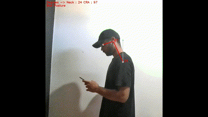

# Cervical Posture - YOLO Pose Estimation

## This repository contains Python code for analyzing cervical posture in videos using YOLO pose estimation. The program can help identify potential posture problems that may lead to neck pain or discomfort.



**Disclaimer:** While this program can be a helpful tool, it should not be used as a sole method for diagnosing or treating medical conditions. Always consult with a healthcare professional for any posture-related concerns. 
The project is still under development, it is necessary to adjust the angle values ​​based on scientific evidence. Some physiotherapists are being contacted for this purpose.

### How it Works

The code follows these steps:

1. **YOLO Pose Estimation:** It leverages a pre-trained YOLO deep learning model to detect specific body points (nose, ears, and shoulders) in each frame of a video. YOLO is known for its speed and accuracy in object detection tasks.

2. **Angle Calculation:** Once the key body points are identified, the program calculates angles between the neck (ear and shoulder), and the craniocervical angle (ear, nose, and shoulder). These angles provide insights into the user's cervical posture.
3. **Posture Classification:** Based on the calculated angles and predefined thresholds, the program classifies the posture as good, reasonable, or bad. You can customize these thresholds within the code to adjust the classification criteria for your specific needs.

4. **Visualization:** The program overlays the following information onto the output video:
- Lines connecting the detected nose, ear, and shoulder key points.
- Circles around the detected key points.
- Text displaying the calculated angles for reference.
- Text indicating the classified posture (good, reasonable, or bad).

### Benefits of Use

Analyzing cervical posture with this program offers several benefits:

- Early Detection of Posture Issues: By identifying deviations from good posture, the program can help users become aware of potential problems before they cause pain or discomfort.
- Posture Improvement Aid: The visual feedback provided by the posture classification can guide users towards maintaining a healthy cervical posture while performing activities like watching videos or working at a computer.
- Non-invasive and Objective Assessment: This program offers a non-invasive way to assess cervical posture compared to traditional methods that might require physical examinations or subjective evaluations.
- Potential for Personalized Posture Training: With further development, this technology could be integrated into training programs to help users develop better postural habits.

### Installation

1. Install required libraries:
```Bash
pip install ultralytics numpy opencv-python
```

2. Download a pre-trained YOLO pose estimation model (e.g., 'yolov8m-pose.pt'). Place it in the same directory as the script (`cervical_posture.py`).

### Usage
```Python
python cervical_posture.py
```

### Arguments:

- `video_path` (str, optional): Path to the video file. Defaults to 'demo.mp4'.
- `model_path` (str, optional): Path to the YOLO pose estimation model file. Defaults to 'yolov8m-pose.pt'.
- `side` (str, optional): Analyze posture for the 'left' or 'right' side. Defaults to 'left'.
- `conf` (float, optional): Confidence threshold for YOLO pose detection. Defaults to 0.3.

### Output:

The program will generate a new video file (`output_video.mp4`) with the information mentioned in the "Visualization" section.

### Customization

- Modify `video_path` and `model_path` arguments in the script to use your own video and model files.
- Adjust the `conf` argument to control the minimum confidence level for pose detection.
- The script uses predefined thresholds for `posture` classification. You can modify these thresholds within the posture function to adjust the classification criteria.
